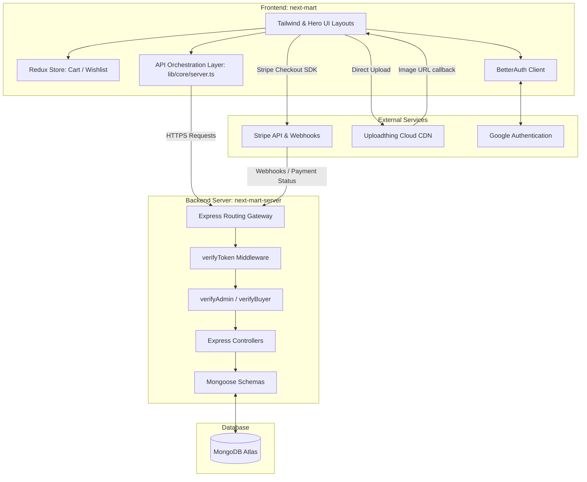

# 🛒 NextMart E-Commerce Platform

NextMart is a modern, high-performance, decoupled e-commerce ecosystem. It features a fast **Next.js 16 (App Router, React 19)** frontend paired with a robust **Node.js, Express, & Mongoose** backend. The ecosystem leverages **BetterAuth** for authentication, **HeroUI v3** and **Tailwind CSS v4** for clean interface design, and **Stripe** for payment processing with automatic stock synchronization.

---

## 🏗️ System Topology & Architecture

NextMart follows a modern decoupled architecture where the client application (`next-mart`) interfaces with a headless backend API server (`next-mart-server`). Authentication state is securely federated: the frontend uses BetterAuth (with a local MongoDB instance) and synchronizes session data with the Express server via a JOSE JWT handshake.



---

## ✨ Core Ecosystem Features

- 🔐 **Dual-Layer Federated Authentication**:
  - Frontend-managed authentication using **BetterAuth** (supporting credentials & Google OAuth).
  - Backend synchronization handler (`/auth/sync`) that validates the user session and issues a **JOSE JWT** to secure REST endpoints.
- 🛒 **Interactive Shopping Cart & Wishlist**:
  - Local state persistence using **Redux Toolkit** and **Redux Persist**.
  - **Guest Cart Merge**: Automatic client-side merging of guest shopping carts into the user's persistent database cart upon login.
- 📦 **Dynamic Catalog & Advanced Caching**:
  - **Incremental Static Regeneration (ISR)** for product lists and detail pages (`revalidate = 300` / 5 minutes) for optimal SEO and performance.
  - Advanced search query indexing in MongoDB for full-text search capabilities across catalog documents.
- 🛠️ **Unified Role-Gated Dashboards**:
  - **Admin Workspace**: Complete inventory controls (add/edit/delete items), upload assets via Uploadthing, and view analytics charts designed with Recharts.
  - **Buyer Workspace**: View complete order history, shipping updates, and transaction details.
- 🛡️ **In-Flight Content Moderation**:
  - Auto-scanning middleware (`moderation.middleware.ts`) that rejects product additions/modifications if they contain flagged words or prohibited terminology.
- 💳 **Stripe Checkout Webhook Pipeline**:
  - Secure redirection to Stripe Checkout.
  - Webhook handlers intercept success signals, write transaction logs, decrement product `stockCount`, and increment `soldQuantity`.

---

## 🛠️ Technology Stack

### Frontend Client (`next-mart`)
* **Framework**: Next.js 16 (React 19 & React Compiler enabled)
* **Styling**: Tailwind CSS v4 & PostCSS
* **UI Components**: HeroUI v3 (formerly NextUI) & Framer Motion
* **State Management**: Redux Toolkit & Redux Persist (with LocalStorage adapter)
* **Auth Core**: BetterAuth v1 (MongoDB Adapter & Google OAuth)
* **Media Handling**: Uploadthing SDK
* **Analytics Rendering**: Recharts

### Backend API Server (`next-mart-server`)
* **Environment**: Node.js & Express (TypeScript execution via `tsx`)
* **Database ODM**: Mongoose / MongoDB Atlas
* **Security Core**: Jose (JWT validation and signing)
* **Payments**: Stripe SDK
* **Cross-Origin**: CORS enabled with credential checks

---

## 📂 Repository File Structures

### Frontend Layout (`next-mart`)
```text
next-mart/
├── public/                 # Static assets & placeholders
├── src/
│   ├── app/                # Next.js App Router Pages
│   │   ├── (auth)/         # Gated Auth Group (login, register)
│   │   ├── (public)/       # Shop listing, details, static informational pages
│   │   ├── dashboard/      # Unified dashboard (admin/buyer sub-routes)
│   │   ├── items/          # Add/Manage inventory actions
│   │   ├── checkout/       # Success page redirection targets
│   │   ├── layout.tsx      # System Providers, Navbar, and Footer layouts
│   │   └── page.tsx        # Homepage landing page sections
│   ├── components/         # Reusable UI component library
│   │   ├── common/         # Global Layout elements (Navbar, Footer, Sidebars)
│   │   ├── product/        # Card representations, Skeletons, Reviews
│   │   └── dashboard/      # Custom charts and stats panels
│   └── lib/
│       ├── api/            # API queries (GET requests helper layers)
│       ├── actions/        # API mutations (POST/PUT/DELETE handler wraps)
│       ├── core/           # Base server-fetch client interceptor
│       └── store/          # Redux toolkit store slices & persist pipeline
```

### Backend Layout (`next-mart-server`)
```text
next-mart-server/
├── src/
│   ├── config/             # Database connectivity & ENV parser
│   ├── middleware/         # Token validation & Content moderation gates
│   ├── models/             # Database schemas (User, Product, Transaction)
│   ├── controllers/        # Business logic handler operations
│   ├── routes/             # Router declarations mapped to endpoints
│   ├── types/              # Ambient Express request TS type augmentation
│   └── server.ts           # Express bootstrapper & configuration
```

---

## 🚦 Local Quickstart & Setup Guide

Ensure you have **Node.js (v18+)** and a **MongoDB instance** (local or Atlas cluster) ready.

### 1. Clone & Install Dependencies
First, clone the repositories (or locate the folders locally) and install dependencies:

```bash
# Set up Frontend
cd next-mart
npm install

# Set up Backend
cd ../next-mart-server
npm install
```

### 2. Configure Environment Variables
Create the necessary environment configuration files in the root directories of each project.

#### Frontend `.env.local` (`next-mart/.env.local`)
```env
MONGODB_URI="mongodb+srv://..."
BETTER_AUTH_SECRET="your-better-auth-secret-key"
NEXT_PUBLIC_APP_URL="http://localhost:3000"

# Google Auth Provider
GOOGLE_CLIENT_ID="google-client-id"
GOOGLE_CLIENT_SECRET="google-client-secret"

# Uploadthing Media Configuration
UPLOADTHING_TOKEN="your-uploadthing-token"

# Backend API Endpoint
NEXT_PUBLIC_API_URL="http://localhost:5000/api"
```

#### Backend `.env` (`next-mart-server/.env`)
```env
MONGODB_URI="mongodb+srv://..."
PORT=5000
FRONTEND_URL="http://localhost:3000"
JWT_SECRET="your-jose-jwt-signing-secret"

# Payments
STRIPE_SECRET_KEY="sk_test_..."
STRIPE_WEBHOOK_SECRET="whsec_..."
```

### 3. Run the Applications

Start both servers concurrently.

```bash
# In the next-mart directory (Frontend)
npm run dev # Starts client on http://localhost:3000

# In the next-mart-server directory (Backend API)
npm run dev # Starts Express API on http://localhost:5000
```

---

## 📡 REST API Endpoint Documentation

All backend routes are prefixed by `/api` and require a `Bearer <token>` in the `Authorization` header for protected paths.

### 🔐 Authentication Routes
| Method | Endpoint | Access | Description |
| :--- | :--- | :--- | :--- |
| `POST` | `/api/auth/sync` | Public | Validates BetterAuth session, syncs with backend database, and returns JWT. |

### 📦 Product Catalog Routes
| Method | Endpoint | Access | Description |
| :--- | :--- | :--- | :--- |
| `GET` | `/api/products` | Public | Fetch all products (supports category, brand, and text search filters). |
| `GET` | `/api/products/:id` | Public | Fetch detailed single product record (including reviews). |
| `POST` | `/api/products` | Protected (Admin) | Create a new catalog item. Runs content moderation. |
| `PUT` | `/api/products/:id` | Protected (Admin) | Update product fields. Runs content moderation. |
| `DELETE` | `/api/products/:id` | Protected (Admin) | Remove a product from the database catalog. |

### 💳 Checkout & Transactions
| Method | Endpoint | Access | Description |
| :--- | :--- | :--- | :--- |
| `POST` | `/api/checkout/create-session` | Protected (Buyer) | Initiates Stripe Checkout transaction with selected cart items. |
| `POST` | `/api/checkout/webhook` | Public (Stripe) | Stripe webhook listener handling order synchronization & stock adjustments. |

### ❤️ Wishlist Routes
| Method | Endpoint | Access | Description |
| :--- | :--- | :--- | :--- |
| `GET` | `/api/wishlist` | Protected | Retrieves active items in authenticated user's wishlist. |
| `POST` | `/api/wishlist` | Protected | Adds a product to the user's wishlist. |
| `DELETE` | `/api/wishlist/:productId` | Protected | Removes a product from the user's wishlist. |

### 📊 Admin Analytics Routes
| Method | Endpoint | Access | Description |
| :--- | :--- | :--- | :--- |
| `GET` | `/api/admin/stats` | Protected (Admin) | Retrieve total revenue, sales quantities, and transaction counts. |

---

## 📌 Development Scripts Reference

### Frontend Commands (`next-mart`)
* `npm run dev`: Boot up the Next.js local development server (port `3000`).
* `npm run build`: Compile a highly optimized Next.js production build.
* `npm run start`: Deploy production-built server locally.
* `npm run lint`: Run ESLint analysis checking static rules.

### Backend Commands (`next-mart-server`)
* `npm run dev`: Starts the Node Express API server with TS watch mode (`tsx watch`).
* `npm run build`: Compile TypeScript files down to raw JavaScript (`tsc`).
* `npm run start`: Run production build server (`node dist/server.js`).

---

## 📄 License

This repository is licensed under the Apache 2.0 License. See the [LICENSE](file:///c:/Users/Junaid/Documents/GitHub/next-mart/LICENSE) file for more details.
